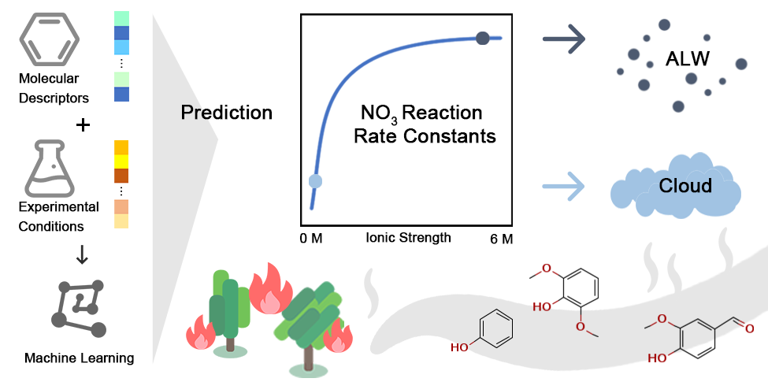

# IMI-NO3
Predicting aqueous-phase reaction rate constants (kaq) between VOCs and NO3 in cloud water and deliquescent aerosols.  

## Introduction
Integrated molecular representations and ionic conditions framework (IMI-NO3) is a machine learning-based predictive tool toward reaction rate constants between volatile organic compounds (VOCs) and nirate radical (NO3) in atmospheric aqueous phase. By encoding the concentrations of the inorganic ions in the reaction system as input features, IMI-NO3 enables an accurate prediction of rate constants for non-ideal solutions with a high ionic strength up to 6 M. Therefore, it can be applied to both cloud water and aerosol liquid water. 
## Usage
* Enter the molecular structure of the reactant in SMILES:
    ```
    smiles = ['C', 'CC', 'CCC']
    ```
    For a specific molecule, you can find its SMILES on [PubChem](https://pubchem.ncbi.nlm.nih.gov/).
* Define the ionic condition:
    ```
    # The unit of ionic concentrations is mol/L
    ionic_conc = {"H_+": 0.0001, "Na_+": 0.1, "ClO4_-": 0.1} 

    # H_+, Na_+, K_+, NO3_-, ClO4_-, and S2O8_2- are usable.
    # The concentrations should be within the range of 0 to 6 mol/L
    ```
* Do calculation:
    ```
    c = calculator.Calculator()

    ret = pd.DataFrame()
    ret['output'] = c.run(smiles, ionic_conc)
    ```
* The predefined ionic conditions for CFW and ALW:
    ```
    ret['output_CFW'] = c.run_cloud(smiles)
    ret['output_ALW'] = c.run_alw(smiles)
    ```
    More details could be found in example.py
## Citation
This repository is for the paper entitled "Predicting Nitrate Radical Reaction Rate Constants of Organic Compounds in the Atmospheric Aqueous Phase Affected by Inorganic Ions", which is published in **Environmental Science & Technology** and can be read [here](https://doi.org/10.1021/acs.est.5c10685).  
Please kindly cite our papers if you use the data/code/model.
```
@article{gu_predicting_2026,
	title = {Predicting Nitrate Radical Reaction Rate Constants of Organic Compounds in the Atmospheric Aqueous Phase Affected by Inorganic Ions},
	volume = {60},
	issn = {0013-936X},
	url = {https://doi.org/10.1021/acs.est.5c10685},
	doi = {10.1021/acs.est.5c10685},
	pages = {5559--5569},
	number = {7},
	journaltitle = {Environmental Science \& Technology},
	shortjournal = {Environ. Sci. Technol.},
	publisher = {American Chemical Society},
	author = {Gu, Linghao and Chen, Zhongming and Jia, Yulu and Xu, Yuanxiang and Dai, Yishuang},
	date = {2026-02-24},
}

```
